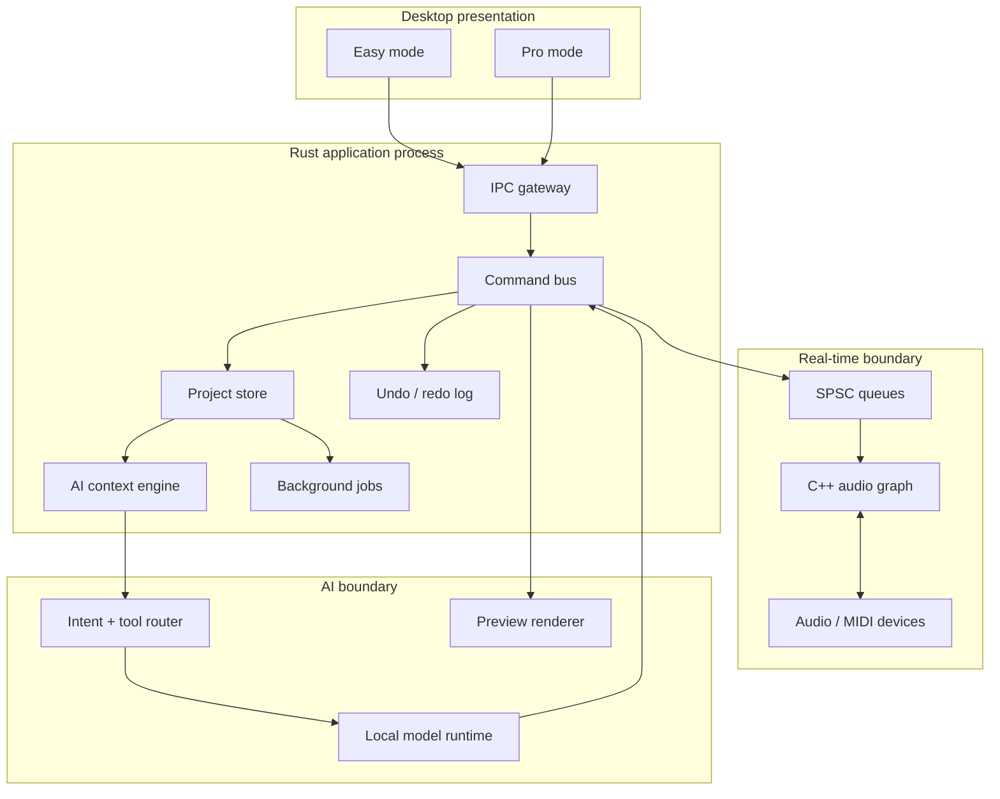
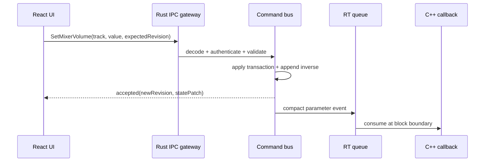
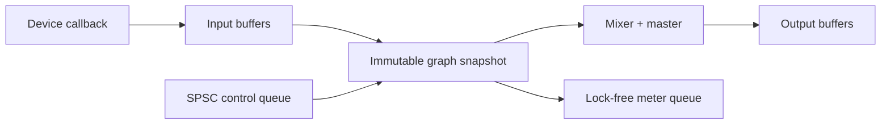
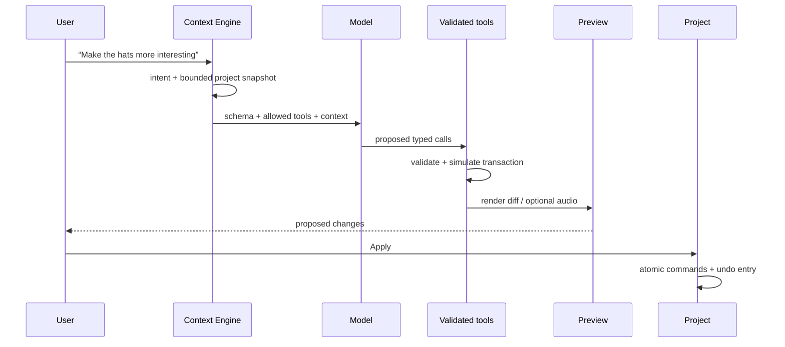

# LarTycc Technical Design v1

Status: accepted for Phase 0; later phases require architecture decision records
(ADRs) for deviations. This design prioritizes deterministic audio, reversible
editing, local-first operation, and clear language boundaries.

## 1. System architecture



**DECISION** — A modular monolith with a separately isolated C++ real-time
engine and optional worker processes. **WHY** — it keeps project transactions
simple while preserving the one boundary that truly needs hard isolation.
**ALTERNATIVES** — all-C++, all-Rust, or microservices. **TRADE-OFFS** — FFI and
IPC add contract work, but ownership and failure domains stay understandable.

## 2. Language boundaries

| Layer | Owns | Must not own |
| --- | --- | --- |
| C++20 | callback, graph, DSP, MIDI scheduling, buffers | files, UI, ML, blocking locks |
| Rust | canonical project, commands, undo, jobs, assets, orchestration | DSP callback implementation |
| TypeScript | views, interactions, accessibility, visualization | authoritative state or direct DSP control |
| Python | offline ingestion, training, evaluation, export | shipped callback or project mutation |

**DECISION** — Every mutation is a Rust command. **WHY** — manual UI, shortcuts,
automation, and AI then share validation, permissions, audit, and undo.
**ALTERNATIVES** — per-client mutations or shared mutable objects.
**TRADE-OFFS** — more command types and serialization, substantially less state
drift and a testable AI safety boundary.

## 3. UI → Rust → C++ flow



UI transport is local, typed, request/response IPC. A desktop-host spike will
choose between Tauri commands, local domain sockets, and an embedded webview
bridge. Protobuf defines cross-process contracts; in-process calls may use
native Rust types. UI messages include a request ID and expected project
revision. Stale writes receive a conflict rather than silent last-write-wins.

**DECISION** — Protobuf for process boundaries; a narrow versioned C ABI for
Rust↔C++ engine control. **WHY** — generated IPC contracts and stable FFI avoid
exposing C++ ABI details. **ALTERNATIVES** — JSON everywhere, CXX/cbindgen,
Cap'n Proto. **TRADE-OFFS** — schema generation and explicit compatibility
rules, in exchange for language-neutral tooling and forward evolution.

## 4. Real-time audio flow



The control thread builds graph snapshots, preallocates resources, and atomically
publishes a pointer. The callback owns no project model; it consumes bounded,
sample-timestamped events and writes telemetry to a lossy queue. Graph retirement
uses epochs so memory is never freed while a callback can reference it.

### Audio-thread safety rules

- no allocation/deallocation, file/network I/O, logging, exceptions, ML, or UI;
- no mutexes, condition variables, unbounded loops, or ref-count destruction;
- no system clock queries; use host sample position;
- bounded lock-free SPSC queues only; define overflow policy per message class;
- denormal protection, finite-value validation, precomputed coefficients;
- plugin calls get deadlines and later move behind crash/sandbox isolation;
- debug builds instrument callback duration without blocking the callback.

**DECISION** — 32-bit float internal audio with 64-bit timeline/sample positions.
**WHY** — common plugin/device compatibility and SIMD efficiency while avoiding
timeline rollover. **ALTERNATIVES** — double precision throughout. **TRADE-OFFS**
— lower memory/bandwidth at the cost of less headroom for extreme offline DSP;
selected processors may use double internally.

## 5. Project data model and persistence

The canonical aggregate is `Project { id, schema_version, revision, tempo_map,
signature_map, tracks, buses, assets, arrangement, patterns, automation,
markers, mixer, metadata }`. Entities have UUIDs; musical time uses integer
pulse positions at a declared PPQ, while audio placement also records original
sample rate and frame offsets. Asset references use content hashes plus a
project-relative locator. UI-only selection and zoom state are not project truth.

On disk, `.lartycc` is a versioned ZIP container with `project.json`, `assets/`,
`previews/`, and `manifest.json`. Writes go to a sibling temporary file, flush,
then atomic replace. Autosave is an append-only command journal plus periodic
snapshot. Loaders validate size limits, paths, schema, hashes, and migrations
before creating live objects. Unknown future fields are preserved where safe.

**DECISION** — inspectable JSON snapshot plus binary assets, not a database file.
**WHY** — debugging, recovery, migrations, and third-party tooling matter early.
**ALTERNATIVES** — SQLite, FlatBuffers, custom binary. **TRADE-OFFS** — larger and
slower parsing; snapshots are compressed and runtime state remains native.

## 6. Command system

Each command implements `validate(context)`, `apply(project) -> Effect`, and
`invert(effect) -> Command`. An envelope contains command ID, actor, timestamp,
expected revision, schema version, and origin (`ui`, `shortcut`, `ai`, `system`).
Composite commands are atomic. Validation checks syntax, project invariants,
resource quotas, capabilities, and real-time schedulability. Effects include a
state patch, inverse, dirty regions, and compact engine messages.

Commands are deterministic: they contain resolved IDs and values, not phrases
such as “the selected clip”. Long jobs reserve intent, compute off-thread, then
submit a result command against the expected revision. Conflicts are surfaced
and may be recomputed; they are never silently applied to another state.

## 7. Undo/redo architecture

The history stores transactions with their inverse commands and optional asset
references. New edits after undo form a new branch; Phase 1 may expose only a
linear view while keeping branch metadata. Parameter drags coalesce within one
gesture. Saved-state is a revision marker. Large generated assets use immutable,
content-addressed storage and reference counting rather than copying blobs into
history. AI proposals enter history only when applied; preview is ephemeral.

**DECISION** — inverse-command transactions plus periodic snapshots.
**WHY** — semantics remain explicit and replay supports recovery/testing.
**ALTERNATIVES** — full snapshot per edit or event sourcing alone.
**TRADE-OFFS** — every command needs a correct inverse; snapshots bound replay
time and property tests verify apply→inverse equivalence.

## 8. Threading model

| Execution context | Responsibilities | Communication |
| --- | --- | --- |
| audio callback | graph, DSP, scheduled events | SPSC queues / snapshots |
| Rust main | command serialization, project truth | async channels |
| UI thread | render and input | typed IPC |
| worker pool | waveform, analysis, file decode, export | cancellable jobs |
| AI worker | inference and tool planning | bounded request/result |
| plugin host (later) | third-party plugins | shared audio ring + IPC |

Only the Rust main executor commits mutations. Workers receive immutable input
snapshots and cancellation tokens. Priority order is audio > MIDI ingest > UI
control > preview > analysis > AI/training. Backpressure drops stale meters and
waveforms first, never note-off or transport-stop events.

## 9. AI prompt → project flow



The Context Engine selects only relevant tracks, time range, harmony, tempo,
edit history, and learning level. It redacts file paths and personal metadata.
Model output is untrusted structured data. Tools have capability scopes, value
limits, complexity budgets, deterministic seeds, and no arbitrary shell/files.
Educational answers are separated from mutation plans.

**DECISION** — two-stage plan then validated tools, always requiring approval
for destructive or broad edits. **WHY** — a model must never mutate project
memory directly. **ALTERNATIVES** — raw code generation or direct function
access. **TRADE-OFFS** — extra latency, but preview, audit, and undo become real.

## 10. MIDI tokenization proposal

Beat Generator v0 uses event tokens: `BOS`, style/tempo/time-signature/key
conditioning, `BAR`, `POSITION_0..95`, `TRACK_*`, `NOTE_ON_0..127`,
`VELOCITY_0..31`, `DURATION_*`, `TIE`, `PEDAL_*`, and `EOS`. Quantization is 24
steps/quarter (96 per 4/4 bar) for drums; melodic passages may use delta-time
buckets plus exact residual metadata. Tempo is bucketed for conditioning, while
the source value remains in metadata. Special tokens encode unknown key and
unquantized events. Augmentation transposes tonal parts but never drum maps.

**DECISION** — REMI-like bar/position events with explicit track and duration.
**WHY** — beat structure is visible, sequences stay compact, and infilling is
straightforward. **ALTERNATIVES** — MIDI byte stream, piano roll tensors, absolute
time. **TRADE-OFFS** — quantization loses microtiming unless residuals are kept;
96-step bars are a deliberate v0 size/feel compromise.

## 11. Dataset format v0

Each example is a directory or sharded record containing `example.json`,
`events.npy`/`events.jsonl`, optional source MIDI, and a checksum. Required
metadata: ID, dataset/version, provenance, license/SPDX, consent basis, allowed
uses, split, source hash, dedup group, tokenizer version, genre tags, tempo map,
time signature, key confidence, track roles, bar count, quality flags, and every
transformation with seed/version. Splits are artist/source-group aware.

See [DATASETS.md](DATASETS.md) for schema and governance.

## 12. Beat Generator v0

A decoder-only Transformer generates 4–16 bar symbolic drum and bass patterns
conditioned on BPM, style tags, density, swing, energy curve, and optional seed
melody rhythm. Tiny target: ~25M parameters, 8 layers, width 512; Small: ~80M,
12 layers, width 768; Medium: ~250M, 18 layers, width 1024. Exact sizes follow
profiling. It produces three seeded candidates and confidence/constraint reports.

Train with next-token prediction, then infilling/fill objectives and preference
fine-tuning on legally usable human ratings. Curriculum: clean four-bar drums,
multi-track patterns, conditional transforms, then continuation/infill. Export
ONNX first; evaluate llama.cpp/ExecuTorch only if operator coverage and latency
are superior. Quantize weights to int8/int4 after quality gates.

**DECISION** — symbolic generation before text-to-audio. **WHY** — edits remain
musical, explainable, cheap, and reversible on consumer hardware.
**ALTERNATIVES** — diffusion audio or cloud LLM tool calls. **TRADE-OFFS** — cannot
invent timbre directly, but solves the beginner workflow with far less compute.

## 13. Training and evaluation

Training is reproducible from immutable manifests: validate rights → normalize
MIDI → map instruments → deduplicate → tokenize → group split → train → evaluate
→ export → sign model card. Log code revision, manifest hash, tokenizer, config,
seeds, environment, and metrics. Checkpoints never enter Git.

Offline metrics: token NLL/perplexity, note precision/recall, onset F1, groove
similarity, pitch-class and duration distributions, constraint adherence,
repetition, silence/collision rates, memorization nearest-neighbor distance, and
latency/memory. Human blind tests score musicality, usefulness, controllability,
variety, and edit acceptance. Release gates include no train/test source leakage,
license completion, memorization review, deterministic smoke prompts, and device
latency budgets. See [TRAINING.md](TRAINING.md).

## 14. Local inference and hardware tiers

Inference runs outside the audio callback in a cancellable worker. The request
contains a bounded symbolic snapshot; streaming candidates are validated before
preview. Models are memory-mapped, checksummed, version-compatible, and unloaded
under memory pressure. CPU is the baseline; GPU backends are optional.

| Tier | Target model | Minimum practical hardware | Target first candidate |
| --- | --- | --- | --- |
| Tiny | ~25M int8 | 4-core CPU, 8 GB RAM | <1.0 s for 4 bars |
| Small | ~80M int8/int4 | 6-core CPU, 16 GB RAM or 4 GB VRAM | <2.0 s |
| Medium | ~250M int4 | 8-core CPU, 32 GB RAM or 8 GB VRAM | <4.0 s |

These are design targets, not measured requirements. CI benchmarks on reference
machines will replace estimates before any model release.

## 15. Repository structure

```text
LarTycc/
├── apps/desktop/       # native host
├── core/               # Rust project/command core
├── audio-engine/       # C++20 realtime DSP
├── ui/                 # React/TypeScript
├── ai/                 # Python offline ML
├── ai-runtime/         # Rust local inference adapter
├── shared/schemas/     # persisted contracts
├── proto/              # IPC contracts
├── examples/           # safe example projects
├── assets/             # reviewed product assets
├── scripts/            # developer automation
├── tests/              # integration and e2e
├── docs/               # focused design notes
└── .github/workflows/  # CI
```

## 16. Principal risks

| Risk | Early mitigation | Release gate |
| --- | --- | --- |
| callback underruns | synthetic graph benchmark, no-allocation tests | p99 callback <70% budget |
| cross-language drift | generated schemas + contract tests | compatibility matrix green |
| plugin crashes | process boundary spike, watchdog | host survives crash/hang |
| project corruption | atomic save, journal, fuzz loader | recovery and migration suite |
| AI damages work | simulate/preview/apply + undo | property and adversarial tests |
| dataset rights | provenance ledger + deny-by-default | 100% license coverage |
| model memorization | source-aware split, similarity audit | review threshold passed |
| UI overload | Easy/Pro research and telemetry opt-in | beginner usability study |
| scope explosion | phase gates in ROADMAP | no gate bypass without ADR |

## 17. Deliberately deferred

VST3/CLAP hosting, plugin sandboxing, cloud collaboration, mobile/web editions,
macOS notarization, vocal tools, pitch correction, plugin SDK, marketplace,
text-to-audio, custom synthesizer, mastering assistant, remote inference, and
training a large foundation model are outside Phase 0. JUCE is only evaluated:
it accelerates devices, MIDI, plugins, and cross-platform UI, but AGPL/commercial
licensing, binary size, and framework coupling require a written decision first.

