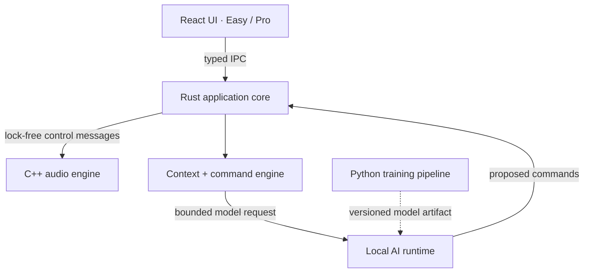

# LarTycc

> An AI-native desktop music workstation designed for beginners without putting
> a ceiling on serious production.

[](ROADMAP.md)
[](LICENSE)

LarTycc is an experimental, local-first DAW for Linux and Windows. Its AI is not
a chat panel glued to a sequencer: it proposes validated project commands,
shows an audible/visual preview, and only mutates the project after approval.
Every applied proposal participates in the same undo/redo history as manual UI
edits. The repository is in **pre-alpha Phase 0**; it does not produce audio yet.

## Product principles

- Easy and Pro modes are two views of the same project.
- C++ owns deterministic real-time DSP; Rust owns project truth and commands.
- React/TypeScript renders UI; Python is restricted to offline training tools.
- Heavy AI work never runs on the audio callback.
- Local inference is the default and paid cloud APIs are optional adapters.
- AI changes are inspectable, previewable, validated, cancellable, and undoable.

## Architecture



The full design, boundaries, threading model, data model, alternatives, and
trade-offs are in [ARCHITECTURE.md](ARCHITECTURE.md). AI details are in
[AI_ARCHITECTURE.md](AI_ARCHITECTURE.md).

## Repository map

| Path | Responsibility | Language |
| --- | --- | --- |
| `audio-engine/` | real-time graph and DSP boundary | C++20 |
| `core/` | project state, commands, undo, jobs | Rust |
| `ai-runtime/` | local model loading and inference adapter | Rust |
| `ui/` | Easy/Pro interface | React + TypeScript |
| `ai/` | dataset, training, and evaluation tooling | Python |
| `proto/` | versioned cross-process message contracts | Protobuf |
| `shared/schemas/` | persisted interchange schemas | JSON Schema |
| `apps/desktop/` | future native host and packaging | undecided |

## Getting started

Prerequisites: CMake 3.21+, a C++20 compiler, Rust 1.81+, Python 3.11+,
Node.js 20+, and npm 10+.

```bash
git clone https://github.com/y0ungmg/LarTycc.git
cd LarTycc

cmake -S . -B build/cpp -DCMAKE_BUILD_TYPE=Debug
cmake --build build/cpp --parallel
ctest --test-dir build/cpp --output-on-failure

cargo test --workspace

python -m venv .venv
source .venv/bin/activate  # Windows: .venv\\Scripts\\activate
python -m pip install -e '.[dev]'
pytest

npm install
npm test
npm run build
```

Run every Phase 0 check with `bash scripts/check.sh` after dependencies are
installed. The desktop host is intentionally not runnable yet.

## Screenshots

Screenshots will be added with the first interactive desktop prototype. No
mockup is presented as a working product.

## Status and scope

Phase 0 provides the architecture, repository boundaries, compilable component
seams, basic tests, and CI. Audio playback, editing, inference, plugins, model
training, pitch correction, and collaboration are intentionally deferred. See
[ROADMAP.md](ROADMAP.md) for gates and [CONTRIBUTING.md](CONTRIBUTING.md) before
opening a pull request.

## License

Source code is licensed under [Apache License 2.0](LICENSE). Third-party
dependencies, models, datasets, samples, and assets keep their own licenses and
must be registered in [LICENSES.md](LICENSES.md). No training dataset or model
weights are included in Phase 0.

